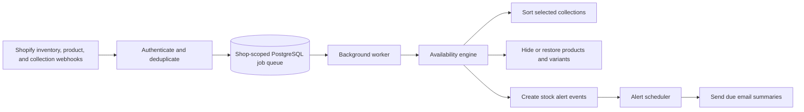

# Inventex

Inventex is an embedded Shopify inventory automation app. It keeps sold-out products at the bottom of selected collections, can hide them from the Online Store, restores them after restock, and sends stock alerts.

This README is both the merchant user manual and the deployment/operator guide for the current implementation.

> [!IMPORTANT]
> Inventex changes product visibility and collection ordering. Test it on a development store before enabling it for a live catalog. Background automation also requires the job and alert cron endpoints described in [Production scheduling](#production-scheduling).

## Contents

- [What Inventex does](#what-inventex-does)
- [How availability is decided](#how-availability-is-decided)
- [Merchant user manual](#merchant-user-manual)
- [Plans and billing](#plans-and-billing)
- [Common automation examples](#common-automation-examples)
- [Troubleshooting](#troubleshooting)
- [Developer and operator guide](#developer-and-operator-guide)
- [Privacy and uninstall behavior](#privacy-and-uninstall-behavior)
- [Known limits](#known-limits)

## What Inventex does

Inventex has three main automations:

1. **Collection sorting** keeps available products in their chosen base order and moves sold-out products to the bottom.
2. **Product hiding** removes sold-out products from the Online Store publication, optionally creates redirects, and reverses those changes after restock.
3. **Stock alerts** sends short-batched, daily, or weekly email summaries for low-stock and out-of-stock products or variants.

Every automation uses the same availability engine. Shopify webhooks only record incoming events and queue work; slow Shopify mutations never run inside the webhook request.



## How availability is decided

Inventex evaluates all variants and inventory locations for a product.

| Situation | Inventex result | Automation behavior |
| --- | --- | --- |
| At least one variant has stock at a location that fulfills online orders | In stock | Keep visible and in the available section |
| Inventory is not tracked | In stock | Keep visible; quantity is not used |
| A zero-stock variant allows selling when out of stock | In stock by default | Keep with available products |
| Continue-selling separation is enabled | Continue selling | Place between normally available and sold-out products |
| Every tracked variant is unavailable at online-fulfilling locations | Sold out | Sort last and, if enabled, schedule hiding |
| Product has `inventex-ignore` or is in the excluded-products list | Ignored | Skip Inventex hide/sort automation for that product |

Important details:

- Inventex totals stock across locations whose Shopify setting `fulfillsOnlineOrders` is true.
- A single location reaching zero does not make a product sold out if another online-fulfilling location or variant has stock.
- Stock at a POS-only location does not count. A POS location does count when it is also configured to fulfill online orders.
- `soldOutAt` is recorded on the first sold-out transition and retained while the product remains sold out. This makes delayed hiding stable across repeated webhooks.
- Product and inventory webhooks trigger a complete re-evaluation, so tags and inventory-policy changes are handled consistently.

## Merchant user manual

### 1. Install and open Inventex

Install the app from Shopify and approve the requested permissions. Inventex opens inside Shopify Admin under **Apps → Inventex**.

On first install, Inventex creates a shop session and default shop settings. Stores that require billing must select a suitable plan before automation can run. Eligible development and trial stores can use automation without a paid charge.

### 2. Complete onboarding

The dashboard asks you to begin with one automation:

- Choose **Sort collections** if products should remain visible but sold-out items should appear last.
- Choose **Hide sold-out products** if sold-out product pages should disappear from the Online Store.

This choice only determines the first setup path. You can enable both features later.

### 3. Read the dashboard

The dashboard summarizes live app state:

- **Sorting** shows how many collections have automatic sorting enabled and whether sort jobs are queued.
- **Hiding** shows whether hiding is enabled, how many products Inventex has hidden, and whether a catalog scan is running.
- **Alerts** shows whether alerts are enabled and whether alert work is queued.
- **Plan** shows the Active + Draft product count, current entitlement, and required plan.
- **Needs attention** surfaces failed automation or dead-letter jobs.

When hiding is enabled and billing access is valid, **Scan now** queues a fresh catalog evaluation. The scan runs in the background.

### 4. Automatically sort collections

Open **Sort Collections** from the app navigation.

The page lists Shopify collections in pages of 50. You can search, inspect product counts, choose a base sorting type, and enable or disable Inventex per collection.

#### Enable sorting for one collection

1. Find the collection.
2. Turn on **Auto sorting**.
3. Confirm the action if prompted.
4. Wait for the background job to finish.

When enabled, Inventex:

1. Saves the collection's current Shopify sort type and ordered product IDs.
2. Changes the Shopify collection to **Manual** ordering.
3. Preserves the selected base order within each availability group.
4. Places available products first, optionally continue-selling products second, and sold-out products last.

Shopify Admin should continue to show **Manual** while Inventex controls the collection. This is expected.

#### Choose the Sorting Type

The available base orders are:

- A–Z
- Z–A
- Best selling
- Oldest first
- Newest first
- Manual
- Price: low to high
- Price: high to low

Changing **Sorting Type** in Inventex recalculates the saved base order and re-sorts the collection. It does not change the Shopify collection away from Manual; Inventex needs Manual ordering to move the out-of-stock group.

#### Restocks and original positions

When a product first becomes sold out, Inventex saves its position. When it is restocked, the product returns to its base position among the currently available products instead of being appended randomly.

#### Shopify-side sort changes

If someone changes the collection's sort type in Shopify Admin from Manual while Inventex sorting is enabled, Inventex treats that as a merchant override and disables auto-sorting for that collection. Re-enable it in Inventex if the change was accidental.

#### Enable all collections

**Enable all** processes every collection in the store, not only the currently visible page. Each collection receives its own saved state and background sort job.

#### Disable collection sorting

Turn off **Auto sorting** for the collection. Inventex stops controlling that collection and restores the Shopify sort type that was saved when automation was enabled.

> [!NOTE]
> Large and frequently changing collections are debounced to avoid repeated Shopify reorder calls. Webhook-triggered re-sorts use longer delays as collection size increases, from roughly 30 minutes for small collections up to 24 hours for collections with 10,000 or more products. Initial user-requested work is still queued immediately where supported.

### 5. Hide sold-out products

Open **Hide Products**.

#### Enable hiding

1. Turn on **Hide sold-out products from Online Store**.
2. Choose a delay from 0 to 365 days.
3. Save the setting.

Inventex queues a catalog scan. Hide settings are temporarily locked while the scan is active so that two conflicting scans cannot be started.

For each eligible sold-out product, Inventex:

1. Unpublishes the product from the **Online Store publication only**.
2. Adds the Shopify tag `inventex-hidden`.
3. Optionally creates a same-store URL redirect.
4. Saves the publication and redirect state for restoration.

Inventex does not unpublish the product from POS, Google, or other sales channels.

#### Configure the hide delay

- **0 days** means the hide job is eligible immediately after the sold-out transition.
- **N days** means the product remains visible until `soldOutAt + N days`.
- If the product is restocked before the delay ends, the pending hide is cancelled.

#### Configure redirects

Open **Settings** and choose one redirect mode:

- **None** leaves the old product URL without an Inventex redirect.
- **Home page** redirects `/products/{handle}` to `/`.
- **Custom path** redirects to a path on the same store, such as `/collections/all`.

Inventex stores the Shopify redirect ID and removes that redirect when the product is restored.

#### Restock a hidden product

After a restock webhook, Inventex re-evaluates the full product. If it is available again, Inventex:

1. Publishes the product back to the Online Store.
2. Removes `inventex-hidden`.
3. Deletes the redirect created by Inventex.
4. Cancels any pending hide job.

Restoration only occurs while the product still has `inventex-hidden`. If a merchant manually removes that tag, Inventex respects the override and leaves the product unpublished.

#### Disable hiding

Turning the feature off queues a background job to republish products owned by Inventex hiding. The job republishes the product to the Online Store, removes the app tag, and cleans up the stored redirect.

### 6. Exclude products from automation

Use **Hide Products → Ignore products** to select products that Inventex should skip. The picker writes the exclusion to Inventex and adds `inventex-ignore` to Shopify.

You can also add the `inventex-ignore` tag directly in Shopify. Tag matching is case-insensitive.

Ignored products are not hidden or moved into the sold-out group. Remove the product from the ignore list or remove the tag to allow future evaluations.

### 7. Hide sold-out variants (beta)

Open **Settings** and enable **Hide sold-out variants**.

For multi-variant products, Inventex unpublishes only sold-out variants from the Online Store and republishes them after restock. The product remains published while any variant is available.

The beta is limited to stores with at most 500 products published to the Online Store. If the catalog exceeds the limit, variant hiding is skipped. Variant settings are locked while a variant scan or restore job is active.

### 8. Configure stock alerts

Open **Alerts** and turn alerts on.

#### Select recipients

Enter up to five valid email addresses, separated by commas. The store's primary email is suggested when no list has been saved.

#### Select alert conditions

Choose one or both:

- **Low stock**, with a threshold from 1 to 5,000 units.
- **Out of stock**.

At least one condition is required while alerts are enabled.

Choose whether Inventex checks availability at the **Product** or **Variant** level.

#### Select frequency

- **Within a few minutes** groups qualifying events for two minutes after the latest change, then sends one email containing every product or variant. Repeated alerts for the same target and condition have a four-hour cooldown after delivery.
- **Once per day** sends one digest after the selected local time each day.
- **Weekly digest** sends on the selected local weekday and time, and never more often than seven days after the last successful weekly digest.

Timezone calculations use named timezones and account for daylight-saving changes.

#### Send a preview

Save at least one recipient, then use **Send preview**. The preview uses the saved sender configuration and recipient list; it does not change product inventory.

> [!NOTE]
> Production email requires `RESEND_API_KEY` and a verified `ALERT_FROM_EMAIL`. Alerts fail closed when email delivery is not configured.

### 9. Review activity

Open **Activity Logs** to inspect:

- Recent product automation and restoration state.
- Errors returned by Shopify or the email provider.
- Jobs that exhausted retries and moved to the dead-letter list.
- Shopify Admin API call and throttle metrics.

Use the product, collection, or job identifiers in a log entry when investigating an issue. Access tokens are never included in structured logs.

## Plans and billing

Inventex uses the store's total **Active + Draft** product count.

| Plan | Monthly price | Product allowance |
| --- | ---: | ---: |
| Inventex Starter | $9.99 | Up to 100 |
| Inventex Growth | $14.99 | Up to 1,000 |
| Inventex Pro | $19.99 | Up to 10,000 |
| Inventex Enterprise | $39.99 | Unlimited |

- Paid plans include a 7-day trial.
- Eligible partner development, Development, Trial, and Shopify Plus Trial stores receive free automation access.
- A non-development store must approve an active Shopify app subscription before sorting, hiding, or alerts run.
- If the product count exceeds the active plan, automation pauses and the app displays the minimum required upgrade.
- Billing approval and cancellation are handled through Shopify.

## Common automation examples

### One location reaches zero

A product has 0 units at Warehouse A and 7 units at Warehouse B. Both fulfill online orders. Inventex totals the relevant locations and keeps the product in stock.

### Stock exists only at a POS location

A product has 0 units at its online warehouse and 4 units at a location that does not fulfill online orders. Inventex treats the product as sold out for Online Store automation.

### One variant remains available

A shirt is sold out in Small and Medium but has stock in Large. The product remains in stock. With variant hiding enabled, only the sold-out variants are unpublished.

### Continue selling is enabled in Shopify

A zero-stock product with **Continue selling when out of stock** remains available by default. If **Separate continue-selling products** is enabled in Inventex Settings, it is placed between normally available and fully sold-out products.

### Inventory is not tracked

Shopify does not provide a reliable sold-out transition for an untracked item, so Inventex treats it as in stock.

### Delayed hide followed by restock

A product sells out with a three-day hide delay. It is restocked the next day. Inventex cancels the pending hide and the product remains published.

## Troubleshooting

| Symptom | What to check |
| --- | --- |
| A collection did not sort immediately | Look for a queued job on the dashboard. Webhook re-sorts are debounced, especially for large collections. Confirm the collection is enabled and Shopify still shows Manual. |
| Auto sorting turned itself off | Someone or another app changed the Shopify collection sort type away from Manual. Re-enable Inventex after resolving the conflict. |
| A product was not hidden | Confirm hiding and billing access are active, the delay has elapsed, the product is sold out at every online-fulfilling location, and it has neither `inventex-ignore` nor an exclusion entry. |
| A product was hidden even though a POS location has stock | Confirm that location is configured in Shopify to fulfill online orders. POS-only stock is intentionally excluded. |
| A restocked product remains unpublished | Confirm it is genuinely available online and still has `inventex-hidden`. Removing that tag is treated as a merchant override. Check Activity Logs for API errors. |
| A redirect remains | Check whether the product still has `inventex-hidden`, then review Activity Logs. Redirects left after uninstall are intentionally not cleaned up automatically. |
| Alerts do not send | Confirm alerts and billing are active, recipients are saved, a condition is selected, `/cron/alerts` runs regularly, and Resend sender configuration is valid. |
| Alert summaries repeat too often | The same target and condition has a four-hour cooldown after delivery. Confirm `/cron/alerts` is not being invoked concurrently by multiple schedulers. |
| Variant hiding does not run | The beta pauses above 500 Online Store-published products. Also verify the setting and job status. |
| The dashboard says payment is required | Open Plans and approve a plan that covers the current Active + Draft product count. |
| Work remains in Needs attention | Inspect the dead-letter job and Shopify API metrics in Activity Logs, correct the underlying problem, then re-trigger the relevant scan or action. |

## Developer and operator guide

### Technology

- Shopify embedded app using React Router and App Bridge.
- Shopify GraphQL Admin API version `2026-07`.
- Prisma with PostgreSQL.
- Database-backed job queue using `FOR UPDATE SKIP LOCKED`.
- Resend for transactional stock-alert email.
- Vitest, TypeScript, ESLint, Prisma validation, and a production build in CI.

### Requirements

- Node.js `>=20.19 <22` or `>=22.12`.
- npm.
- PostgreSQL.
- Shopify CLI and a Shopify Partner app.
- A public HTTPS application URL for OAuth, embedded app traffic, webhooks, and cron endpoints.
- Resend account and verified sender domain if email alerts are enabled.

### Environment variables

Copy `.env.example` to `.env` for local development and supply these through the production host's secret manager.

| Variable | Production | Purpose |
| --- | --- | --- |
| `DATABASE_URL` | Required | PostgreSQL connection string used by Prisma. |
| `SHOPIFY_API_KEY` | Required | Shopify app client ID/API key. Safe to identify the app, but keep configuration controlled. |
| `SHOPIFY_API_SECRET` | Required, secret | Validates OAuth and signed webhook requests. Never expose it to the browser or logs. |
| `SHOPIFY_APP_URL` | Required | Public HTTPS base URL of the deployed app, for example `https://inventex.example.com`. This is not the Shopify Admin embedded URL. |
| `SCOPES` | Required | OAuth scopes matching `shopify.app.toml`. |
| `CRON_SECRET` | Required, secret | Bearer token protecting the job and alert cron endpoints. Production fails closed without it. |
| `SUPPORT_EMAIL` | Required | Merchant-facing support contact. |
| `RESEND_API_KEY` | Required, secret | Authenticates email delivery through Resend. The production process fails closed if it is absent. |
| `ALERT_FROM_EMAIL` | Required | Verified From address used for alert email. Development defaults to `Inventex <onboarding@resend.dev>` when blank; production fails closed. |

Never commit real secret values. Generate `CRON_SECRET` as a long random value independent of the Shopify secret.

### Resend email setup and test

For local development, add the API key to `.env`. The sender can remain blank while using Resend's onboarding domain:

```dotenv
RESEND_API_KEY="re_your_resend_api_key"
ALERT_FROM_EMAIL=""
```

Development email is sent from `Inventex <onboarding@resend.dev>`. For production, verify your sending domain in Resend and configure a friendly sender:

```dotenv
RESEND_API_KEY="re_your_production_api_key"
ALERT_FROM_EMAIL="Inventex <alerts@your-domain.example>"
```

All application email goes through the server-only `sendEmail` helper. It accepts HTML, plain text, or both:

```ts
import { sendEmail } from "./app/services/email.server";

await sendEmail({
  to: "merchant@example.com",
  subject: "Inventex email test",
  html: "<p>Your Inventex email integration is working.</p>",
  text: "Your Inventex email integration is working.",
});
```

To test through the app, enable Alerts, save a recipient, and select **Send preview**. Delivery errors are returned to the preview screen and written to structured logs without API keys or recipient addresses.

### Local setup

```bash
git clone https://github.com/ahmar-js/inventex-shopify-app.git
cd inventex-shopify-app
npm install
```

Create `.env` from `.env.example`, point `DATABASE_URL` at PostgreSQL, and add Shopify development-app credentials. Then generate Prisma Client and apply committed migrations:

```bash
npm run setup
```

Link the repository to the intended Shopify app if needed:

```bash
npm run config:link
```

Start Shopify's local development tunnel:

```bash
npm run dev
```

The Shopify CLI updates development URLs when `automatically_update_urls_on_dev` is enabled. Install the development build on a test store and open it from Shopify Admin.

### Shopify app configuration

Before a production deploy, replace the placeholders in `shopify.app.toml`:

```toml
application_url = "https://your-production-domain.example"

[auth]
redirect_urls = ["https://your-production-domain.example/api/auth"]
```

Keep Admin API `2026-07` aligned in both `shopify.app.toml` and `app/shopify.server.ts`.

The current access scopes support:

| Scope | Why Inventex needs it |
| --- | --- |
| `read_products`, `write_products` | Read inventory behavior and manage app-owned product tags. |
| `read_inventory` | Evaluate tracked quantities across locations. |
| `read_publications`, `write_publications` | Hide and restore products or variants on the Online Store publication. |
| `read_locations` | Determine which locations fulfill online orders. |
| `write_online_store_navigation` | Create and delete product URL redirects. |

Deploy Shopify configuration so app-specific webhook subscriptions and compliance topics are registered:

```bash
npm run deploy
```

The registered topics include inventory updates, product create/update/delete, collection create/update/delete, app subscription updates, app uninstall, scope updates, and the GDPR compliance trio.

### Production scheduling

Run both endpoints from a trusted scheduler. Send the same secret as a Bearer token.

| Endpoint | Recommended schedule | Responsibility |
| --- | --- | --- |
| `POST /cron/jobs` | Every minute | Claims and processes queued inventory, sort, hide, restore, and scan jobs. |
| `POST /cron/alerts` | Every minute | Sends due short-batched, daily, and weekly alert summaries. |

Example:

```bash
curl -X POST \
  -H "Authorization: Bearer $CRON_SECRET" \
  https://your-production-domain.example/cron/jobs

curl -X POST \
  -H "Authorization: Bearer $CRON_SECRET" \
  https://your-production-domain.example/cron/alerts
```

Use the host's secret injection feature rather than writing the token directly in scheduler logs or source control. Unauthorized requests are rejected, and production refuses to start without `CRON_SECRET`.

### Job processing and retries

- Every job contains `shop`, type, JSON payload, status, `runAfter`, attempts, unique key, and last error.
- Unique keys debounce or deduplicate repeated work such as `sort:{shop}:{collectionId}`.
- PostgreSQL claims runnable work with row locks and `SKIP LOCKED`, allowing multiple workers without processing the same job concurrently.
- Normal failures retry up to three attempts; Shopify throttle failures retry up to eight attempts.
- Retry delays use exponential backoff with jitter and a 15-minute cap.
- HTTP 429 and GraphQL `THROTTLED` responses are treated as throttling.
- Exhausted jobs are copied to the dead-letter table and shown in Activity Logs.
- Every application table and query is shop-scoped; unique business keys include the shop.

### Webhook behavior

Webhook routes authenticate Shopify, derive an idempotency key from the webhook or resource identity, enqueue shop-scoped work, and return promptly. They do not reorder collections or scan catalogs inline.

Key outcomes:

- `inventory_levels/update` resolves the owning product and queues `evaluate_product`.
- `products/update` re-evaluates tags, tracking, and continue-selling policy.
- Collection events enable defaults, re-sort, disable conflicting automation, or clean up deleted state.
- `app_subscriptions/update` refreshes billing state.
- `app/uninstalled` queues the uninstall event and immediately removes the shop's online and offline sessions without republishing products. Shopify's later `shop/redact` delivery removes the remaining records.
- Compliance handlers return quickly; `shop/redact` removes all remaining shop data.

### Docker deployment

Build the image:

```bash
docker build -t inventex .
```

Run it with production secrets supplied by the host:

```bash
docker run --rm -p 3000:3000 --env-file .env inventex
```

The image installs build dependencies in the build stage and production dependencies in the runtime stage. On boot, `npm run setup` runs `prisma generate` and `prisma migrate deploy` before the web server starts. `DATABASE_URL` must point to the production PostgreSQL database.

Run database migrations as a controlled release step if the hosting platform starts multiple instances simultaneously.

### Validation and CI

Run the same checks used by GitHub Actions:

```bash
npm test
npm run typecheck
npx prisma validate
npm run lint
npm run build
```

The test suite covers availability, sorting and restock order, hide/unhide lifecycle, redirects, tags, variant hiding, alert schedules, billing, job idempotency, retries, and GDPR redaction.

GitHub Actions runs all five checks on pull requests and pushes to `main`.

### Production release checklist

- Configure a stable public HTTPS `SHOPIFY_APP_URL` and matching Shopify URLs.
- Use production PostgreSQL and confirm all Prisma migrations have applied.
- Store secrets in the deployment platform, not in files or logs.
- Configure both cron endpoints and verify unauthorized calls fail.
- Configure Resend and verify the From domain before enabling alerts.
- Approve a Shopify billing charge on a non-development test store.
- Test OAuth install and reauthentication with the offline session.
- Test: enable sort → sell out → confirm sold-out last → restock → confirm restored position.
- Test: enable hiding → sell out → confirm Online Store unpublish, tag, and redirect → restock → confirm reversal.
- Test alerts preview and one scheduled digest.
- Test uninstall and `shop/redact` data cleanup.
- Add final privacy-policy URL, support email, listing screenshots, and App Store metadata.
- Review [`docs/app-store-readiness.md`](docs/app-store-readiness.md) before submission.

## Privacy and uninstall behavior

Inventex stores shop configuration, Shopify sessions, product and collection identifiers, inventory-derived automation state, job records, billing state, operational metrics, and alert recipient email addresses. It does not need to store Shopify customer PII for its inventory features.

- GDPR customer data request and customer redact webhooks are registered and handled as no-ops because customer PII is not retained.
- `shop/redact` deletes all rows for the shop, including settings, sessions, jobs, inventory state, alerts, metrics, and dead-letter records.
- Structured logs include operational identifiers such as shop, job, product, or collection ID but never Shopify access tokens.
- Uninstall intentionally does **not** republish products. App-created tags and redirects can remain in Shopify, matching the safe uninstall behavior of not unexpectedly changing the storefront after access is revoked.
- After uninstall, review products tagged `inventex-hidden` and Shopify URL redirects manually if storefront restoration is desired.

## Known limits

- Variant hiding is a beta limited to 500 Online Store-published products.
- Product and variant hiding affects only the Online Store publication, not every sales channel.
- Background jobs require an external scheduler; web requests alone do not continuously drain the queue.
- Large collection re-sorts are intentionally delayed and may use Shopify bulk operations.
- Email alerts depend on Resend and a verified sender configuration.
- Uninstall does not republish app-hidden products or remove Shopify-side tags and redirects.
- The shippable interface is English only.

## Support

Set the production `SUPPORT_EMAIL` to the monitored address shown to merchants. Never ask merchants to send Shopify access tokens, API secrets, database credentials, or cron secrets in a support request.
